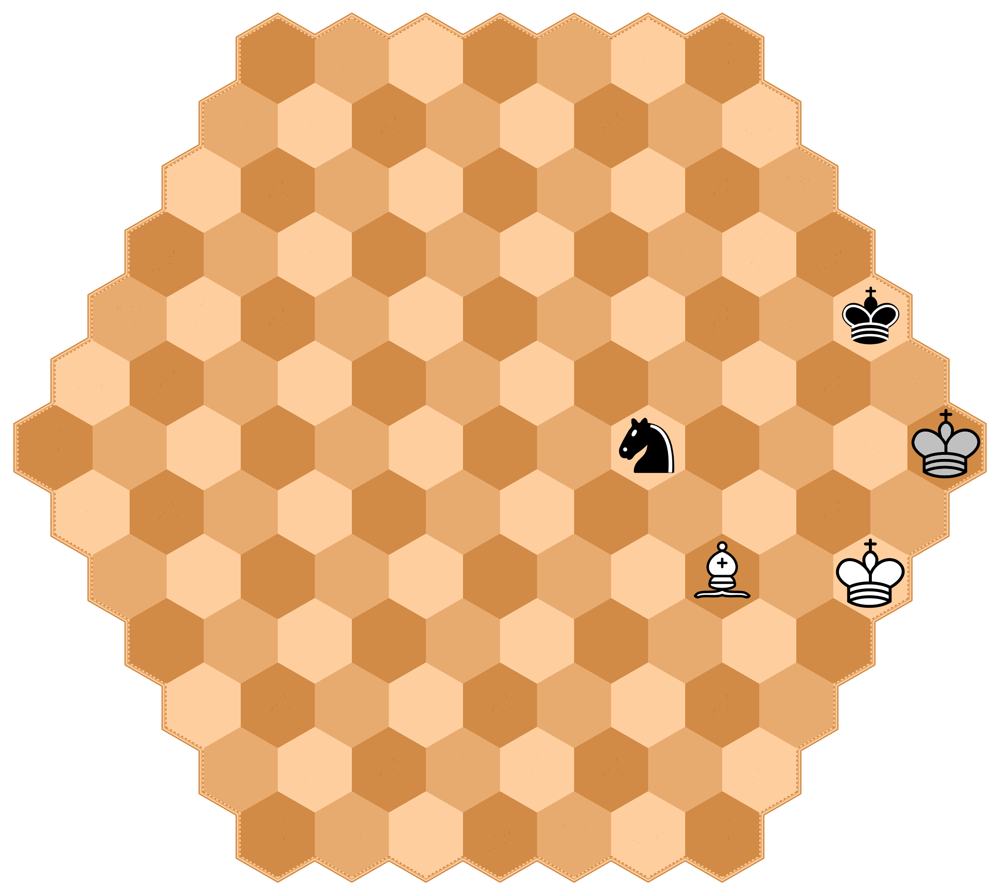
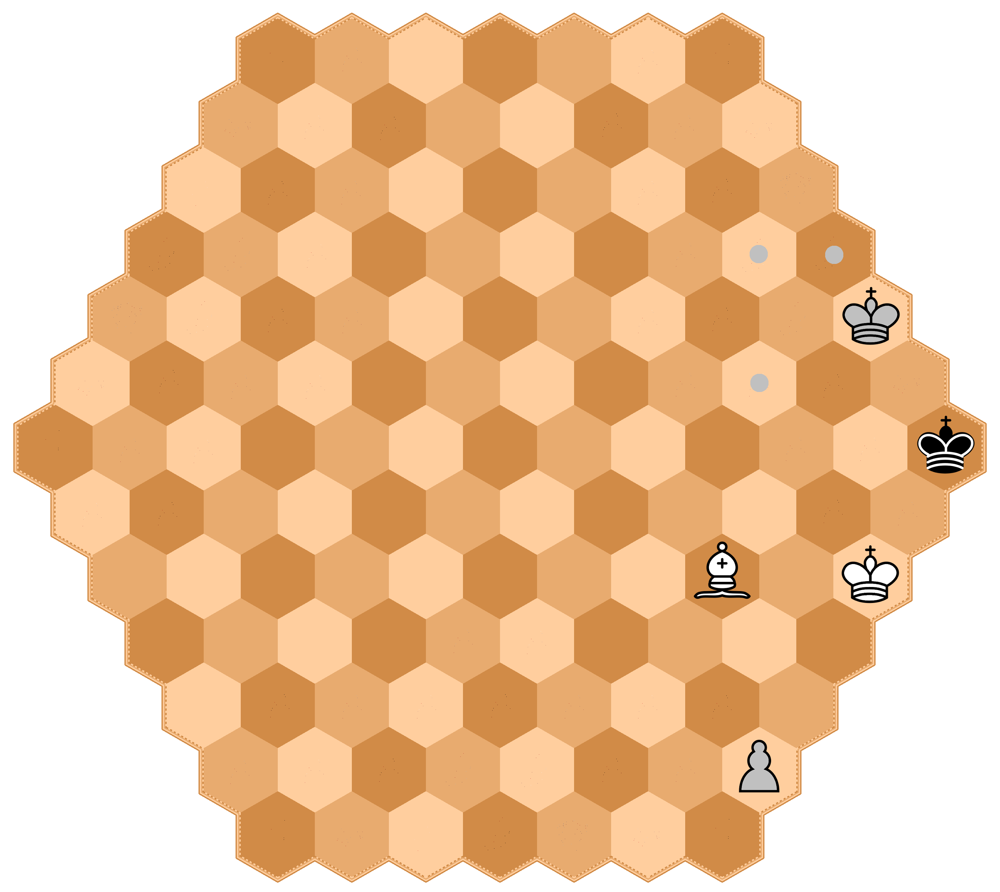
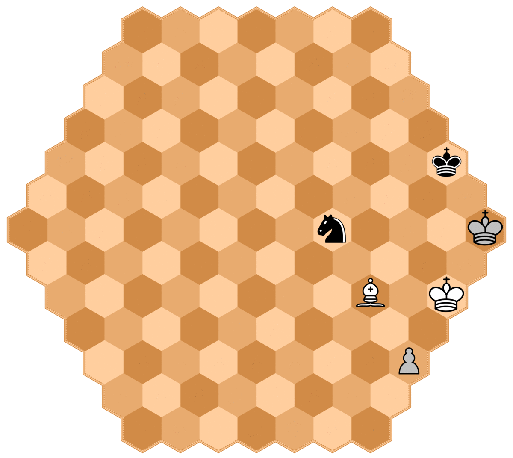

# Rules of Chexss

Chexss is a 3 player generalization of chess.

## Number of pieces and board setup

There are 3 teams in Chexss: white, silver, and black.
Each team starts with the following breakdown of pieces:

| King | Queen | Rook | Knight | Bishop | Pawn |
|:----:|:-----:|:----:|:------:|:------:|:----:|
| 1    | 1     | 2    | 2      | 3      | 15   |

for a total of 24. The game is played on a hexagoanal board
of 127  hexagonal regions (called hexes, or hex singular) arranged
so that there are 7 hexes on each side of the board.

Initial board setup is as shown in the following diagram:

## Movement

The player with the white pieces always moves first, followed
by silver (located to the right of white), then black (located
to the right of silver). In the following diagrams the dots
indicate the locations that each piece can go if no other peices
are in the way.

### King

### Queen

### Rook

### Knight

### Bishop

### Pawn

In the following diagram the dots show the valid pawn moves
if the spaces are empty, the x's show the valid places a capture can
take place and the "star" hexes indicate where a pawn can be 
promoted. The promotion hexes are the base row hexes of the
opposing two teams. Unlike regular chess where you can promote
for any piece you want, you can only readeam a piece that has been
captured by the player whose base row you reached.

Also, unlike regular chess, pawns can only ever move 1 space at a time.
That is, they can not move two spaces on an opening move; therefore,
_en passant_ is not possible.

## Castling

Like castling in classical chess, a player can castle by moving their king
two spaces towards their rook, but due to the setup of the board castling
can only be done queen side.

## En passant

As mentioned earlier, since pawns can not move 2 spaces at any time
_en passant_ is not possible.

## Check

TODO

## End of game

TODO

### Examples
#### White check mates Silver
In this example white has just moved the bishop so that it is attacking the silver king.
Since silver moves after white, since silver is in chech and does not have any valid moves,
the game is over with white the winner.

#### Silver forced to move king
In this example white has just moved the bishop so that it is attacking the black king.
Silver is next to move, but does not have complete freedom of moves because black is in check
and does not have any valid moves as the board sits now. If silver does not make room for the
black king to move then the gave will be over. Since silver _must_ make room for black, silver
_must_ move it's king even though it has a pawn on the board that he would be able to move if
black were not in check. Silver only has the 3 valid moves marked the dots, since any other
move would result in black not having any valid moves.

#### Silver, though in check can force black to protect him
In this example white has just moved the bishop so that it is attacking the silver king.
Unlike the first example, in this example the game is not automatically over since silver
_does_ have a valid move, even though the move does not remove the check placed on it by white.
Silver is able to move it's solitary pawn, thus putting it on black to prevent the game from
ending with a white win. After silver moves it's pawn, black now has 4 valid moves that it
can choose from to extend the game as marked on the board with black dots. Black can either
move it's king to give silver somewhere to move it's king, or black may move his knight in
order to block the attack of white's bishop.

# Game Notation

## Board labeling

TODO

## Recording moves

TODO
