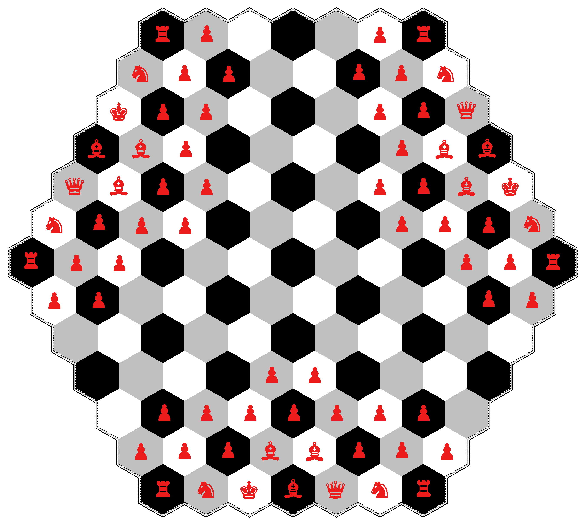
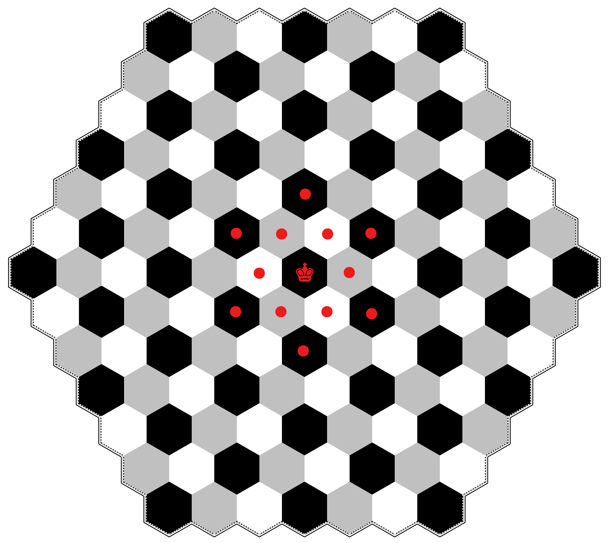
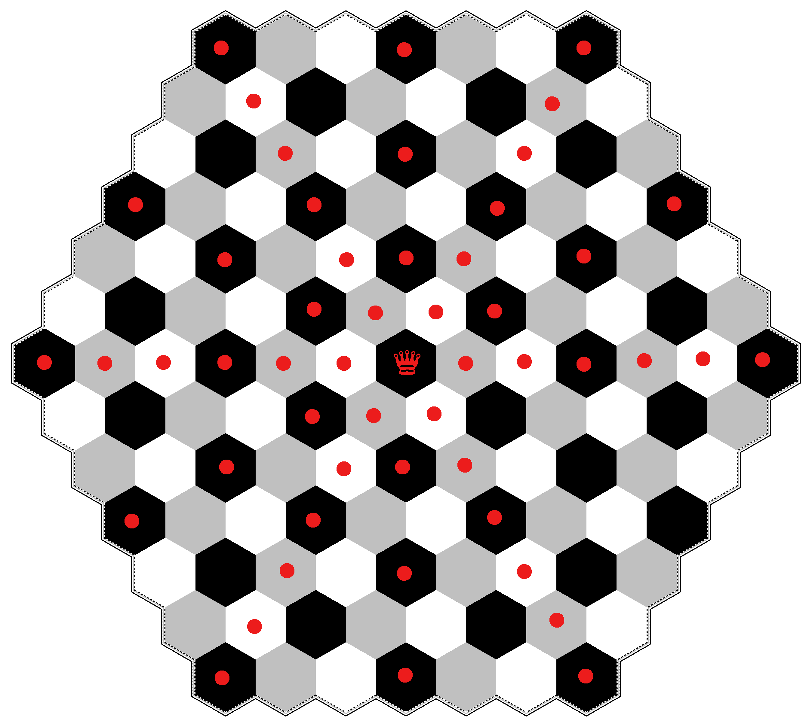
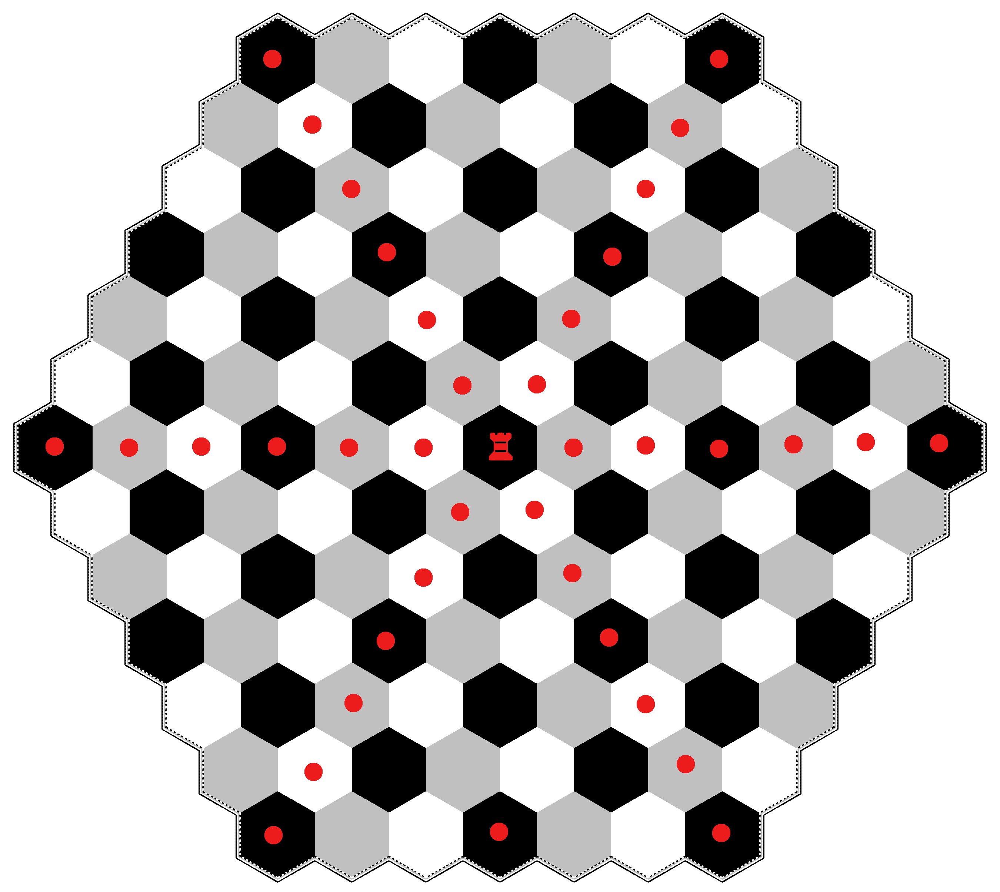
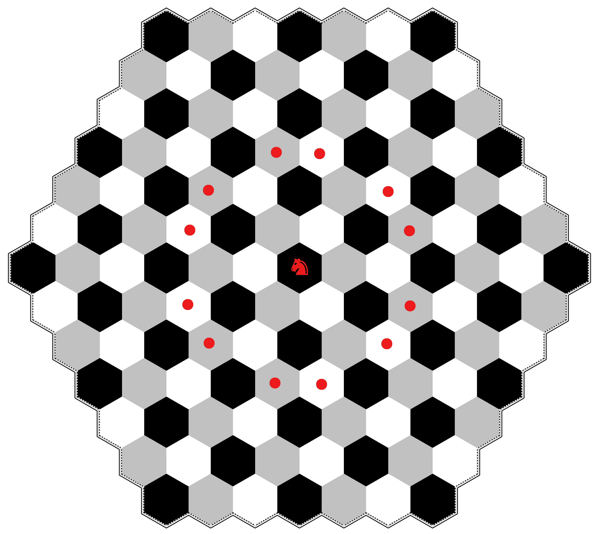
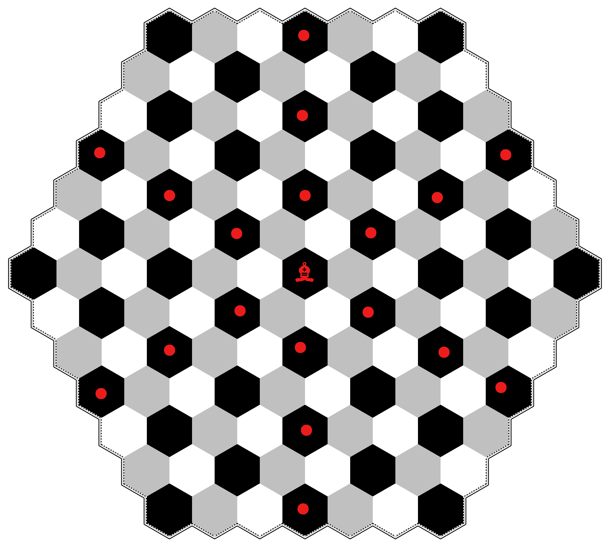
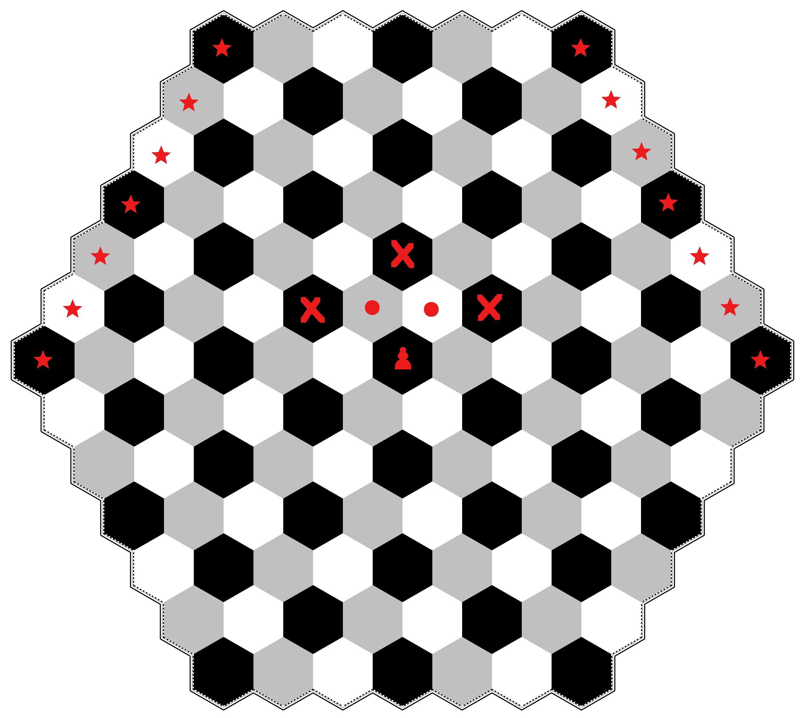

# Rules of Chexss

Chexss is a 3 player generalization of chess.

## Number of pieces and board setup

There are 3 teams in Chexss: white, silver, and black.
Each team starts with the following breakdown of pieces:

| King | Queen | Rook | Knight | Bishop | Pawn |
|:----:|:-----:|:----:|:------:|:------:|:----:|
| 1    | 1     | 2    | 2      | 3      | 15   |

for a total of 24. The game is played on a hexagoanal board
of 127  hexagonal regions (called hexes, or hex singular) arranged
so that there are 7 hexes on each side of the board.

Initial board setup is as shown in the following diagram:

## Movement

The player with the white pieces always moves first, followed
by silver (located to the right of white), then black (located
to the right of silver). In the following diagrams the dots
indicate the locations that each piece can go if no other peices
are in the way.

### King

### Queen

### Rook

### Knight

### Bishop

### Pawn

In the following diagram the dots show the valid pawn moves
if the spaces are empty, the x's show the valid places a capture can
take place and the "star" hexes indicate where a pawn can be 
promoted. The promotion hexes are the base row hexes of the
opposing two teams. Unlike regular chess where you can promote
for any piece you want, you can only readeam a piece that has been
captured by the player whose base row you reached.

Also, unlike regular chess, pawns can only ever move 1 space at a time.
That is, the can not move two spaces on an opening move; therefore,
en passant is not possible.
