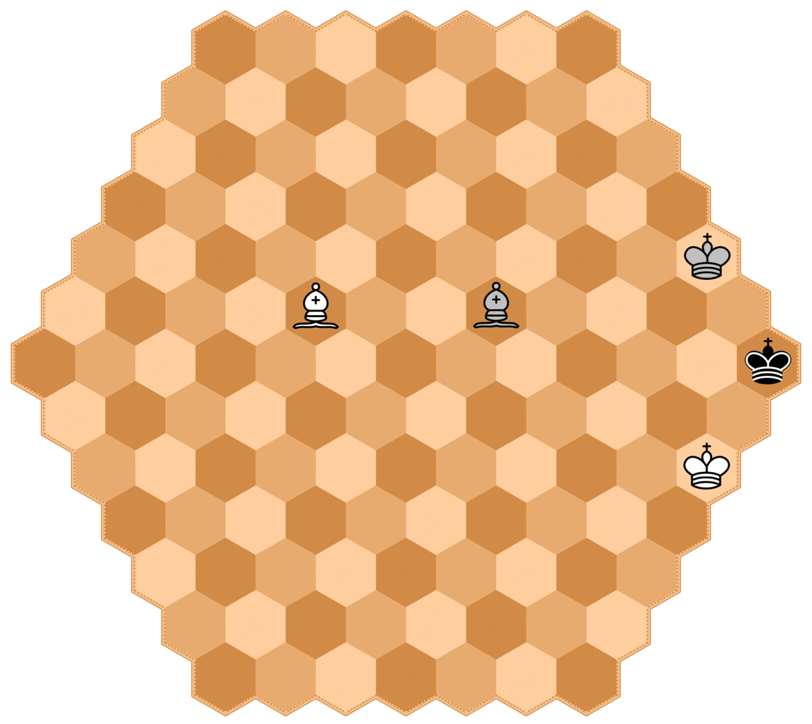

# Rules of Chexss
Chexss is a 3 player generalization of chess.

## Number of pieces and board setup
There are 3 teams in Chexss: white, silver, and black.
Each team starts with the following breakdown of pieces:

| King | Queen | Rook | Knight | Bishop | Pawn |
|:----:|:-----:|:----:|:------:|:------:|:----:|
| 1    | 1     | 2    | 2      | 3      | 15   |

for a total of 24. The game is played on a hexagoanal board
of 127  hexagonal regions (called hexes, or hex singular) arranged
so that there are 7 hexes on each side of the board.

Initial board setup is as shown in the following diagram:

## Movement
The player with the white pieces always moves first, followed
by silver (located to the right of white), then black (located
to the right of silver). In the following diagrams the dots
indicate the locations that each piece can go if no other peices
are in the way.

### King

### Queen

### Rook

### Knight

### Bishop

### Pawn
In the following diagram the dots show the valid pawn moves
if the spaces are empty, the x's show the valid places a capture can
take place and the "star" hexes indicate where a pawn can be 
promoted. The promotion hexes are the base row hexes of the
opposing two teams. Unlike regular chess where you can promote
for any piece you want, you can only readeam a piece that has been
captured by the player whose base row you reached.

Also, unlike regular chess, pawns can only ever move 1 space at a time.
That is, they can not move two spaces on an opening move; therefore,
_en passant_ is not possible.

## Castling
Like castling in classical chess, a player can castle by moving their king
two spaces towards their rook, but due to the setup of the board castling
can only be done queen side.

## En passant
As mentioned earlier, since pawns can not move 2 spaces at any time
_en passant_ is not possible.

## Check
TODO

(Rough sketch of procedure)

* player must defend self if can, only if can't defend self can
they rely on other player to defend

## End of game
TODO

### Examples
#### White check mates Silver
In this example white has just moved the bishop so that it is attacking the silver king.
Since silver moves after white, and since silver is in check and does not have any valid moves,
the game is over with white the winner.

#### Silver forced to move king
In this example white has just moved the bishop so that it is attacking the black king.
Silver is next to move, but does not have complete freedom of moves because black is in check
and does not have any valid moves as the board sits now. If silver does not make room for the
black king to move then the gave will be over. Since silver _must_ make room for black, silver
_must_ move it's king even though it has a pawn on the board that he would be able to move if
black were not in check. Silver only has the 3 valid moves marked by dots, since any other
move would result in black not having any valid moves.

#### Silver, though in check, can force black to protect him
In this example white has just moved the bishop so that it is attacking the silver king.
Unlike the first example, in this example the game is not automatically over since silver
_does_ have a valid move, even though the move does not remove the check placed on it by white.
Silver is able to move it's solitary pawn, thus putting it on black to prevent the game from
ending with a white win. After silver moves it's pawn, black now has only 1 valid move; that is
it must block the attack of white's bishop with his knight. Note that, since white is next to move
after black, it is not sufficent for black to move his king out of the way in order to make
room for silver's king, as white would be able to capture silver's king on the next move before
silver would ever get the change to move to safety.

#### Stolen Mate
This example illustrates the care that must be taken due to the added complexity of having
3 player. White moves their bishop putting black in check, but silver is next to move, not black,
so the game is not over yet. Silver could move their king out of the way to make room for
the black king to move to safety, but silver has an even better play. Silver moves thier
bishop to block the attack of white's bishop. But now silver's bishop is attacking black's
king with black to move. Black has no valid moves, is in check from silver's bishop; therefore
silver wins by checkmate

#### A not quite stolen mate
This example is very similar to the Stolen Mate example except black has another piece
besides his king to move. This prevents silver from stealing the win. White puts black
in check as before and silver tries to steal the mate by moving the bishop in place as before.
The difference this time is, like a previous example, black has a valid move in moving his
knight. White must then take the silver bishop and silver must move their king in order
to provide a path to safety for black's king. Thus checkmate is avoided.

# Game Notation

## Board labeling
TODO

## Recording moves
TODO
